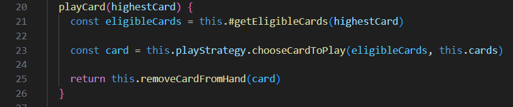

# Chapter Reflections

## Chapter 2: Meaningful Names
The emphasis on intention-revealing names has significantly influenced my approach to naming in code. I’ve started prioritizing clear and descriptive names for classes and methods, which enhances readability and understanding. It might take a bit more time, but the added benefit of not having to look up what a certain function does makes for a much easier development process and error handling.

*From CardTable class.*

## Chapter 3: Functions
The principle of keeping functions small and focused has prompted me to refactor several long methods into smaller, more manageable ones. This practice not only makes my code easier to understand but also simplifies debugging. I feel more able to keep track of what I myself am doing, and what my code is doing, since I can split it into smaller parts which gives greater focus. I have also taken to giving some time to keeping functions at the same abstraction level, as I feel this also helps me with development and bug hunting.

*From HumanPlayStrategy class. Refactored large method into one with several helper methods.*

## Chapter 4: Comments
This chapter has made me realize the importance of writing self-documenting code. I now strive to make my code clear enough that it requires minimal comments, preferrably none at all, but reality is seldom that perfect. While I was very used to adding comments to everything to explain logic (even stuff I felt was self-explanatory) as earlier courses in this program often used an ESLint that required docs to every method (public and private), I’ve learned that good naming and structure can often eliminate the need for them. It almost felt like a freedom, not having to add comments to everything.

*Some comments are good. Here I've chosen to add a comment to connect this to a certain win scenario, to explain why it performs this players.length === 1 check.*

*Comments to explain methods in the public interface will help developers quickly gain insight into the code without having to read everything.*

## Chapter 5: Formatting
I cannot say that this chapter on formatting has influenced my coding style greatly, since I was already very used to following LNU's Eslint which promotes a good approach (not perfect, but good) to code structure. But this chapter has given me a greater understanding of formatting, and what can be considered good and bad formatting, so now I do pay careful attention to indentation, line length, and spacing, ensuring my code is visually appealing and easier to read.
I have taken to heart the ordering of methods, and am keeping The Newspaper Metaphor close in mind at all times.

*Before I would put setters and getters highest in the class. Now I place the most relevant method at the top and the least relevant methods at the bottom, and placing the calling method above its helper methods.*

## Chapter 6: Objects and Data Structures
This chapter deepened my understanding of the distinction between objects and data structures and the importance of encapsulation. While encapsulation has already been something I knew was important, it has only been after reading this chapter that I've seen more in depth how abstracting away details can also help in developing code. So now I place more importance and thought into keeping things encapsulated and only using public as a last resort where it makes logical sense.
I’ve been trying to focus on designing classes that expose behavior rather than just data. For example, in CardTable, I’ve kept most of the internal state private and only allowed access through methods that make sense in the context of the game. That said, I know I could do better — CardTable is doing too much and would probably benefit from being split into smaller, more focused classes. I’m definitely more aware now of how important it is to reduce dependencies and keep things flexible, even if I’m still figuring out how to get it right.

## Chapter 7: Error Handling
This chapter emphasizes the need to handle errors meaningfully rather than ignoring them, as error handling is a critical aspect of robust code. I’ve shifted from using generic error messages or error codes to more descriptive ones that help identify issues quickly. This approach has made debugging much more straightforward and has improved the overall user experience by providing clearer feedback.
Providing clear error messages and separating logic from error handling are key takeaways from this chapter. That said, I feel I have not been great at putting this into practice, as my error handling is very much still a scattered mess in most places.

## Chapter 8: Boundaries
Understanding boundaries helped me recognize the importance of clear interfaces and the need for careful management of dependencies.
I originally used readline for user input, but it caused a chain of async calls that leaked into higher levels of the code. To fix this, I switched to readline-sync, which allowed me to keep the rest of the code cleaner and avoid turning everything into async functions. This experience taught me how important it is to have clear boundaries between parts of the system — like separating input/output logic from the core game mechanics as I have done. It also reminded me to carefully choose libraries and think ahead about how they’ll fit into the architecture.

## Chapter 9: Unit Tests
This chapter reinforced the necessity of unit testing in my development workflow. I’ve realized how well-written tests can provide security during development, and I wish to aim to make my tests as clear and informative as the code itself. I do find it fun to write tests but I often feel that my current knowledge is a bit lacking. I feel a greater motivation and need to learn more about testing framework and functions after this course.
When Martin wrote about the common mistake of writing affirmative tests after the production code I recognized myself a lot. More often than I'd like I add tests after writing the actual code. This is an area in which I hope to improve a lot.
I do feel that I've managed to keep my tests quite clean, simple and minimising the number of asserts. I'm certain a more experienced developer could write much improved tests, but I am still feeling quite satisfied about my tests for my Lab2 lib.

## Chapter 10: Classes
This chapter emphasized creating small, focused classes with a single responsibility. My largest class, CardTable, has become somewhat monolithic, handling both the game flow and card-playing logic. While I’ve chosen to keep it as is for now as I feel it keeps some cohesiveness, I do recognize it violates SRP (Single Responsibility Principle) and should probably be refactored into smaller, more focused classes.
For example, the idea I've entertained is separating the card-playing table from the gameflow mechanics. This would make each class more manageable and testable. I think I’ve done a decent job applying other principles, like using the Strategy Pattern for AI decision-making. That gives me some flexibility to improve the AI logic later without touching other parts of the code. So, while CardTable could definitely use some work, I feel like I’ve made progress in writing other classes that are more focused and purposeful.

## Chapter 11: Systems
This chapter made me think a lot about how to keep high-level logic separate from low-level details. I’ve tried to apply this by making KilleGame responsible for setting up the game and creating all the objects that the game needs to run. This means that core parts like CardTable can focus on their specific tasks without worrying about setup details. However, I know there’s room for improvement—my code isn’t very Open-Closed (OCP), so adding new features would probably mean going back and changing existing classes. That said, I feel good about how I’ve kept things scalable by separating the UI logic from the core game logic, which should make it easier to switch to a different interface later on.

*KilleGame and ConsoleInputHandler are the only classes that should have to change for porting the logic to another UI.*

# Final thoughts
My original vision for this project was to create a web app with a fancy visual UI, allowing players to see the cards being played in real-time. Unfortunately, due to time constraints, I had to pivot midway and simplify the project into a console app. Even with the shift in approach, I made sure to design the architecture in a way that would allow for an easy transition to a different UI in the future. Flexibility and adaptability became key goals.

One of the biggest lessons I learned from this project was not to get too attached to a particular implementation. Sometimes, it’s better to scrap something and start fresh if it means improving the quality and maintainability of the code. This also ties into the importance of simplicity—KISS (Keep It Simple, Stupid) was a principle I leaned on heavily.

At the beginning, I focused too much on just getting the code to work, with plans to refactor later. This approach backfired, leaving me quite stressed. I ended up overcomplicating things and found myself constantly juggling too many details, which led to confusion and frustration. I’d get stuck trying to track what my code was doing, which only made progress slower and more stressful. Taking a step back and some time away helped me see the bigger picture, and when I started refactoring my still-not-working code with Clean Code principles in mind, everything became much clearer. Suddenly, I wasn’t trying to manage as much complexity all at once, and the project felt much more manageable.

That said, following all of the Clean Code rules at the same time was challenging, especially given the time constraints. For example, while I aimed to keep methods and classes small, I made some intentional exceptions for cohesiveness and practicality. In some cases, keeping related logic together made the code easier to follow, even if it meant bending the rules a little. This is one area where I hope to improve in future projects.

Overall, this project taught me the value of flexibility, clarity, and simplicity in code. While there’s still plenty of room for improvement, especially in following Clean Code practices more strictly, I feel like I’ve gained a deeper understanding of how to write cleaner, more maintainable code. That’s something I’ll definitely carry with me for the future.

### Key Areas for Improvement (ie stuff that needs fixing)
* **Reduce method size in CardTable**: Several methods needs to be refactored into smaller versions, with helper methods. This is a work in progress.
* **Documentation**: Adding JSDocs to each non-self-descriptive method in the public interface.
* **Remove Magic Numbers**: Replace the use of magic numbers (number of cards to deal, points value before receiving a strike, number of strikes allowed etc) with constants.
* **Round Restart Logic**: When no player claims to hold the lowest card, the method incorrectly asks again instead of restarting the round.
* **Gameplay Flow**: Add pauses during gameplay to improve the flow and overall user experience.
* **Early exit**: Add logic for ending program early if user wishes.
* **Claim Validation**: Implement checks and messages to indicate whether a player correctly or incorrectly claimed to hold the lowest card.
* **Turn Rotation**: Develop logic to rotate starting players for each round. Currently, rounds always begin with the first-index player, which is not ideal.
* **Main Menu**: Create a start menu for player options, such as entering player names, reading the rules, and starting the game. While this could be considered the responsibility of the UI layer rather than the core game mechanics, it would improve the user experience significantly.
* **AI Player Logic**: Enhance the AI’s card selection algorithm, which is currently too random. Exploring advanced AI options, like using ChatGPT or other strategies, could make gameplay more dynamic and challenging.
* **Second Win Condition**: Implement logic to handle a second win scenario—if all players except one receive a strike in a round.
* **Strike Tie Resolution**: Add functionality to address cases where all players receive a strike in the same round.
* **Lowest Card Tie**: Introduce rules and logic to handle situations where two players hold the lowest card during a round.
* **Add tests for CardTable**: Create better tests for the CardTable class.